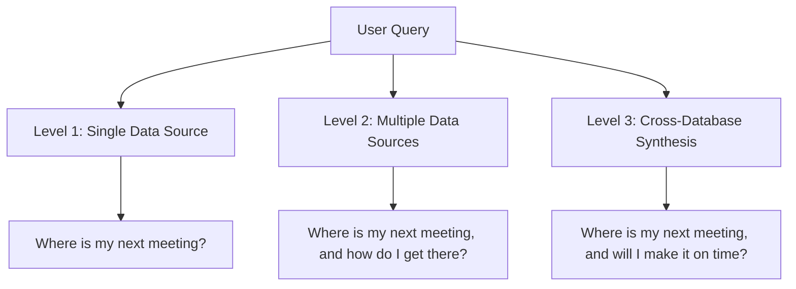
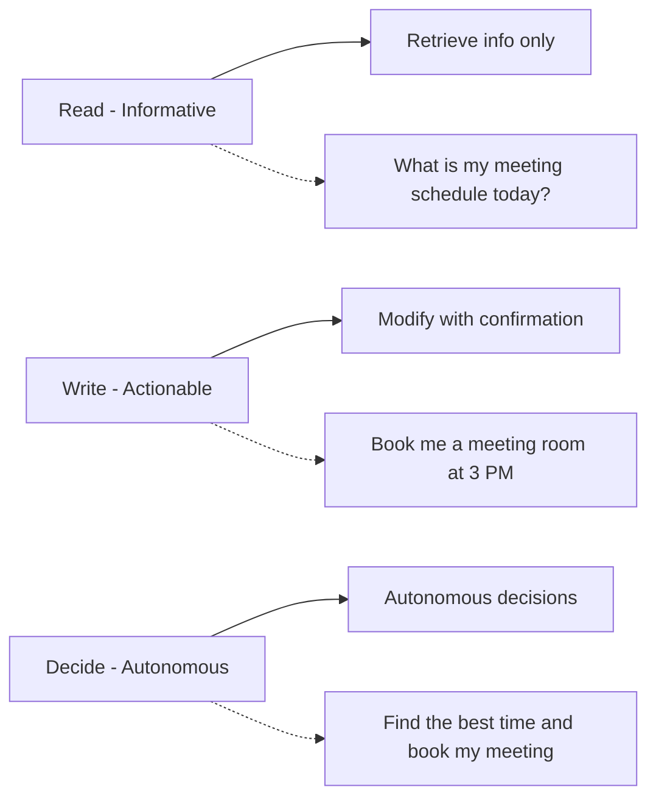
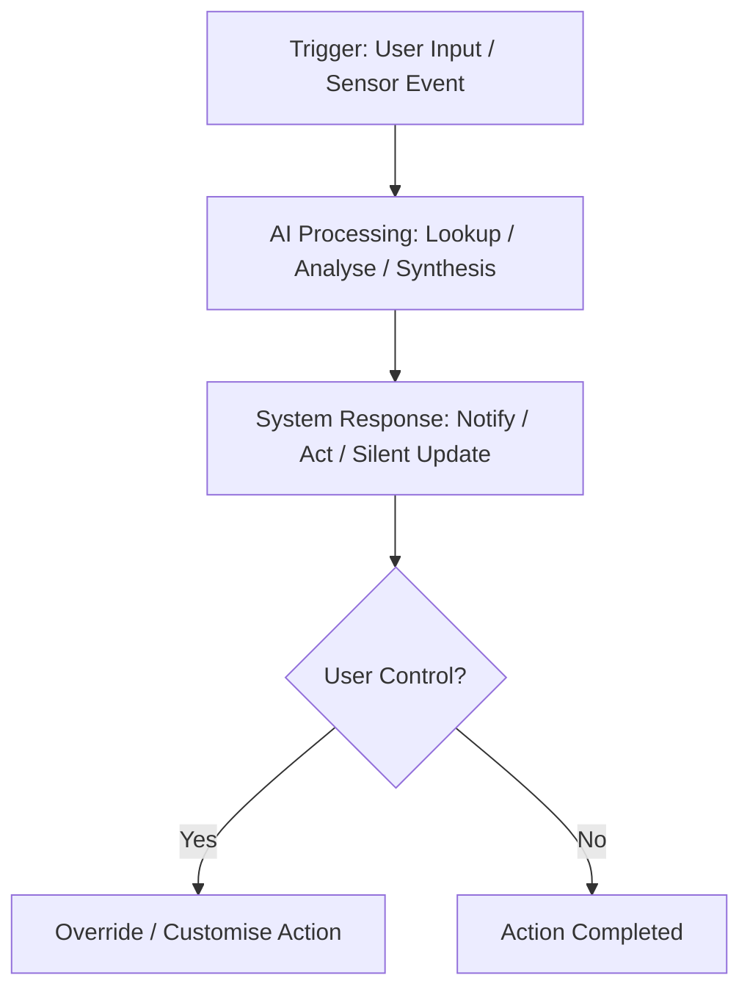

## Introduction & Overview

Traditional UX design relies on visual wireframes and static prototypes, which work well for conventional applications but fall short when designing AI-driven and automated experiences. Unlike static UI elements, AI agents operate dynamically, responding to context, user behaviour, and automation triggers in real-time.

### Key Challenges:

* Mapping AI interactions beyond screens
* Focusing on user intent and automation logic
* Understanding AI agent capabilities and access levels
* Defining AI permissions (read-only, write, or full autonomy)
* Supporting user control and transparency in automated workflows

This framework provides a structured UX scoping process for designing AI-driven, event-based, and automated experiences, ensuring predictability, user control, and transparency.

---

## A Process for Designing UX with Automation & AI Agents

### 1. Define Core User Intent & Context

* Identify primary user tasks
* Determine if AI actions are proactive or reactive
* Define environment (e.g., mobile, smart home, workplace)
* Determine continuity (persistent assistant vs. one-time automation)

### 2. Identify Automation & AI Capabilities

### 3. Define AI Permissions: Read, Write, Decide

Ensure users understand AI actions with summaries and manual override options.

### 4. Map UX Flow with Automation Triggers

Use event-driven models instead of static wireframes.

### 5. Prototype Functional Experiences

* Use decision trees & conversation flows
* Simulate responses (Wizard-of-Oz testing)
* Prioritise user control and clarity

---

## Example User Stories

| User Role       | Scenario             | Trigger           | AI Level             | Action                | User Experience      |
| --------------- | -------------------- | ----------------- | -------------------- | --------------------- | -------------------- |
| Traveler        | Needs flight info    | User query        | Level 1 - Read       | Retrieve from airline | Basic flight details |
| Employee        | Desk location        | User query        | Level 2 - Read       | Lookup desk booking   | Assigned desk shown  |
| Sales Manager   | Automated scheduling | User opts in      | Level 3 - Decide     | Schedule meetings     | Get confirmations    |
| IT Admin        | Detect anomalies     | Suspicious login  | Level 2 - Read/Write | Flag and prompt       | Alert with approval  |
| Smart Home User | Thermostat control   | Presence detected | Level 3 - Decide     | Auto-adjust settings  | Passive comfort      |

---

## Tips for Successful AI UX

* **Think in Systems, Not Screens**: Prioritise flow over layout
* **Predictability**: Clearly signal AI logic
* **User Control**: Provide override and customisation
* **Failure Handling**: Define fallback behaviours
* **Real Data**: Base tests on real-world usage

---

## Workshop Structure: Scoping UX for AI & Automation

```mermaid
gantt
title Workshop Agenda (2-3 Hours)
dateFormat  HH:mm
axisFormat %H:%M
section Introduction
Intro to AI UX         :done, des1, 00:00, 20m
section User Mapping
User Intent Mapping     :done, des2, after des1, 25m
AI Access & Permissions :done, des3, after des2, 30m
Functional Modelling    :done, des4, after des3, 30m
Failure & Recovery      :done, des5, after des4, 30m
Wrap-up & Next Steps    :done, des6, after des5, 15m
```

### Expected Outcomes

* Clear AI access & permission framework
* Trigger-response automation maps
* AI-centric user stories
* Transparent override mechanisms

---

## Rethinking Wireframes in AI UX

### Traditional Wireframing vs. AI Needs

Wireframes have focused on layout, navigation, and components. AI requires:

* Feedback & system updates
* Dynamic personalisation
* Contextual notifications
* Override paths
* Conversational flows

### Adapting Wireframes for AI

#### 1. Wireframe Feedback & Responses

Show dynamic state updates and feedback mechanisms.

#### 2. Design Actionable Notifications

Account for urgency, delivery method, and clarity.

#### 3. Personalisation Mapping

Context-aware UI changes that can be explained and overridden.

#### 4. User Overrides

Visualise undo paths, manual controls, and fallback modes.

#### 5. Conversational & Assistive UX

Use dialogue maps instead of screens to prototype experiences.

---

## Final Thoughts

Designing UX for automation means shifting from screens to systems:

✔ Focus on dynamic feedback over static pages
✔ Make automation transparent and user-controllable
✔ Prototype flows and behaviours, not just layouts
✔ Use real interactions to refine AI experiences
